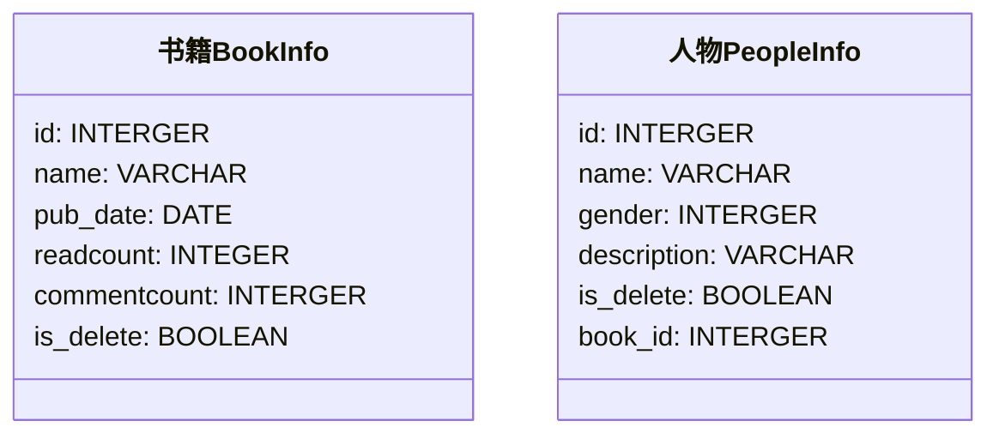

# 模型

## 一、定义模型类




### 1.1 定义书籍表

#### 1.1.1 编码


在 `/bookmanager/book/models.py` 定义模型：

```python
"""
1. 我们的模型类需要继承自 models.Model
2. 系统会自动添加一个主键 id
3. 字段定义
    3.1 属性
        字段名=models.类型(选项)
        字段名不要使用 python、mysql 等关键字
        字段名不要使用连续的下划线（__），因为后面的查询会用到 __
    3.2 类型   MySQL的类型
    3.3 选项  是否有默认值、是否唯一、是否为 null
             CharField 必须设置 max_length
             verbose_name 主要是 admin 站点使用
4. 改变表的名称
    默认表的名称是：子应用名_类名 都是小写
    修改表的名字 使用 class Meta: db_table = ''
"""
from django.db import models


class BookInfo(models.Model):
    name = models.CharField(max_length=10, unique=True, verbose_name='名称')
    pub_date = models.DateField(null=True, verbose_name='发布日期')
    readcount = models.IntegerField(default=0, verbose_name='阅读量')
    commentcount = models.IntegerField(default=0, verbose_name='评论量')
    is_delete = models.BooleanField(default=False, verbose_name='逻辑删除')

    class Meta:
        db_table = 'bookinfo'  # 指明数据库表名
        verbose_name = '书籍管理'  # 在 admin 站点中显示的名称

    def __str__(self):
        return self.name  # 定义每个数据对象的显示信息
```


#### 1.1.2 选项
| 选项        | 说明                                                         |
| ----------- | ------------------------------------------------------------ |
| null        | 如果为 True，表示允许为空，默认值是                          |
| blank       | 如果为 True，则该字段允许为空白，默认值是 False              |
| db_column   | 字段的名称，如果未指定，则使用属性的名称                     |
| db_index    | 如果为 True，则在表中会为此字段创建索引，默认是 False        |
| default     | 默认值                                                       |
| primary_key | 如果为 True，则该字段会成为模型的主键字段，默认值是 False，一般作为 `AutoField` 的选项使用 |
| unique      | 如果为 True，这个字段在表中必须有唯一值，默认值是 False      |

null 是数据库范畴的概念，blank 是表单验证范畴的


### 1.2 定义人物表

#### 1.2.1 编码

在 `/bookmanager/book/models.py` 定义 `PeopleInfo` 模型：

```python
class PeopleInfo(models.Model):
    name = models.CharField(max_length=10, unique=True, verbose_name='姓名')
    # 定义一个有序字典
    GENDER_CHOICE = (
        (1, 'male'),
        (2, 'female')
    )
    gender = models.SmallIntegerField(choices=GENDER_CHOICE, default=1, verbose_name='性别')
    description = models.CharField(verbose_name='描述', max_length=100, null=True)
    is_delete = models.BooleanField(default=False, verbose_name='是否删除')
    # 外键
    # 系统会自动为外键添加 _id

    # 外键的级联操作
    # 主表 和 从表
    #  1  对 多
    # 书籍 对 人物

    # 主表的一条数据 如果删除了
    # 从表有关联的数据，关联的数据怎么办呢？
    # SET_NULL 抛出异常，不让删除
    # CASCADE 级联删除
    book = models.ForeignKey(BookInfo, on_delete=models.CASCADE)

    class Meta:
        db_table = 'peopleinfo'
        verbose_name = '人物信息'

    def __str__(self):
        return self.name
```


#### 1.2.2 外键

在设置外键时，需要通过 `on_delete` 选项指明主表删除数据时，对于外键引用表数据如何处理，在 `django.db.modules` 中包含了可选常量：

* **`CASCADE`** 级联，删除主表数据时连同一起删除外键表中数据
* **`PROTECT`** 保护，通过抛出 **`ProtectedError`** 异常，来阻止删除主表中被外键应用的数据
* **`SET_NULL`** 设置为 `NULL` ，仅在该字段为 `null=True` 允许为 null 时可用
* **`SET_DEFAULT`** 设置为默认值，仅在该字段设置了默认值时可用
* **`SET()`** 设置为特定值或者调用特定方法
* **`DO_NOTHING`** 不做任何操作，如果数据库前置指明级联性，此选项会抛出 **`IntegrityError`** 异常


### 1.3 进行模型迁移

在 `/bookmanager/book/admin.py` 进行模型类的注册后，进行模型迁移：

1. 生成迁移文件

   `python manage.py makemigrations`

2. 执行迁移文件

   `python manage.py migrate`

此时在站点管理中就可以看到创建的表了。


## 二、添加测试数据

先插入主表数据：

```mysql
insert into bookinfo(name, pub_date, readcount, commentcount, is_delete) values 
('射雕英雄传', '1980-5-1', 12, 34, 0),
('天龙八部', '1986-7-24', 36, 40, 0),
('笑傲江湖', '1995-12-24', 20, 80, 0),
('雪山狐狸', '1987-11-11', 58, 24, 0);
```

再插入从表数据：

```mysql
insert into peopleinfo(name, gender, book_id, description, is_delete) values 
('郭靖', 1, 1, '降龙十八掌', 0),
('黄蓉', 0, 1, '打狗棍法', 0),
('黄药师', 1, 1, '弹指神通', 0),
('欧阳锋', 1, 1, '蛤蟆功', 0),
('梅超风', 0, 1, '九阴白骨爪', 0),
('乔峰', 1, 2, '降龙十八掌', 0),
('段誉', 1, 2, '六脉神剑', 0),
('虚竹', 1, 2, '天山六阳掌', 0),
('王语嫣', 0, 2, '神仙姐姐', 0),
('令狐冲', 1, 3, '独孤九剑', 0),
('任盈盈', 0, 3, '弹琴', 0),
('岳不群', 1, 3, '华山剑法', 0),
('东方不败', 0, 3, '葵花宝典', 0),
('胡斐', 1, 4, '胡家刀法', 0),
('苗若兰', 0, 4, '黄衣', 0),
('程灵素', 0, 4, '医术', 0),
('袁紫衣', 0, 4, '六和拳', 0);
```

## 三、shell 工具

`Django` 的 `manage` 工具提供了 `shell` 命令，帮助我们配置好当前工程的运行环境（如连接好数据库等），以便可以直接在终端中执行测试 python 语句。

首先 **进入虚拟环境，在虚拟环境中 **进入 `/bookmanager` 目录，通过如下命令进入 `shell`：

```shell
python manage.py shell
```

导入两个模型类，以便后续使用：

```python
from book.models import BookInfo, PeopleInfo
```

eg：


## 四、数据库操作


### 4.1 增加数据

#### 4.1.1 方法一

```python
from book.models import BookInfo

book = BookInfo(
	name = 'Django',
    pub_date = '2000-1-1',
    readcount = 10
)
# 必须要调用 对象.save() 方法才能将数据保存到数据库中
book.save()
```

#### 4.1.2 方法二

```python
from book.models import BookInfo

# objects 相当于一个代理 实现增删改查
BookInfo.objects.create(
    name = '测试开发入门',
    pub_date = '2020-1-1',
    readcount = 100
)
```


### 4.2 修改数据

#### 4.2.1 方法一

```python
# select * from bookinfo where id = 6
book = BookInfo.objects.get(id = 6)
book.name = '运维开发入门'
# 想要保存数据也需要调用 book.save()
book.save()
```

#### 4.2.2 方法二

```python
BookInfo.objects.filter(id = 6).update(name = '爬虫开发入门', commentcount = 666)
```


### 4.3 删除数据

* 物理删除
* 逻辑删除

#### 4.3.1 方法一

```python
book = BookInfo.objects.get(id = 6)
book.delete()
```

#### 4.3.2 方法二

```python
BookInfo.objects.filter(id = 5).delete()
```


## 五、查询

### 5.1 基础条件查询

#### 5.1.1 基本查询

* `get` 查询单一结果，如果不存在会抛出 `模型类.DoesNotExist` 异常

  ```python
  try:
  	book = BookInfo.objects.get(id = 1)
  	book
  except BookInfo.DoesNotExist:
      print('查询结果不存在')
  ```

* `all` 查询多个结果

  ```python
  books = BookInfo.objects.all()
  books
  ```

* `count` 查询结果数量

  ```python
  BookInfo.objects.all().count()
  BookInfo.objects.count()
  ```

#### 5.1.2 过滤查询

语法：

>`模型类名.objects.方法(属性名称__比较运算符=值)`

* `filter` 过滤出多个结果，获取 n 个结果

  `模型类名.objects.filter(属性名__运算符=值)`

* `exclude` 排除掉符合条件剩下的结果，获取 n 个结果

  `模型类名.objects.exclude(属性名__运算符=值)`

* `get` 过滤单一结果，获取 1个结果 或者 异常

  `模型类名.objects.get(属性名__运算符=值)`


例：

1. 查询编号为 1 的图书

   * 方法一：

     ```python
     # 完整形式 (id__exact=1)
     book = BookInfo.objects.get(id__exact = 1)
     # 简写形式 (属性名 = 值)
     book = BookInfo.objects.get(id = 1)
     # >>> <BookInfo: 射雕英雄传>
     ```

   * 方法二：

     ```python
     # pk 表示 primary key 主键
     BookInfo.objects.get(pk = 1)
     # >>> <BookInfo: 射雕英雄传>
     ```

   * 方法三：

     ```python
     book = BookInfo.objects.filter(id = 1)
     # >>> <QuerySet [<BookInfo: 射雕英雄传>]>
     ```

   `get` 和 `filter` 的区别：

   ​	`get` 方法得到的是一个值

   ​	`filter` 得到的是一个列表

2. 查询书名包含 “湖” 的图书

   ```python
   BookInfo.objects.get(name__contains='湖')
   # >>> <BookInfo: 笑傲江湖>
   BookInfo.objects.filter(name__contains='湖')
   # >>> <QuerySet [<BookInfo: 笑傲江湖>]>
   ```

3. 查询书名以 ”部“ 结尾的图书

   ```python
   BookInfo.objects.filter(name__endswith="部")
   # >>> <QuerySet [<BookInfo: 天龙八部>]>
   ```

4. 查询书名为空的图书

   ```python
   BookInfo.objects.filter(name__isnull=True)
   # >>> <QuerySet []>
   BookInfo.objects.filter(name__isnull=False)
   # >>> <QuerySet [<BookInfo: 射雕英雄传>, <BookInfo: 天龙八部>, <BookInfo: 笑傲江湖>, <BookInfo: 雪山狐狸>]>
   ```

5. 查询编号为 1 或 3 或 5 的图书

   ```python
   BookInfo.objects.filter(id__in=[1,3,5])
   # >>> <QuerySet [<BookInfo: 射雕英雄传>, <BookInfo: 笑傲江湖>]>
   ```

6. 查询编号大于3的图书

   ```python
   # great 大 little 小 equal 等于
   # 大于     gt
   # 小于     lt
   # 大于等于  gte
   # 小于等于  lte
   BookInfo.objects.filter(id__gt=3)
   # >>> <QuerySet [<BookInfo: 雪山狐狸>]>
   ```

7. 查询1980年发表的图书

   ```python
   BookInfo.objects.filter(pub_date__year=1980)
   # >>> <QuerySet [<BookInfo: 射雕英雄传>]>
   ```

8. 查询1990年1月1日后发表的图书

   ```python
   BookInfo.objects.filter(pub_date__gt='1990-1-1')
   # >>> <QuerySet [<BookInfo: 笑傲江湖>]>
   ```

### 5.2 F 和 Q 对象

#### 5.2.1 F 对象

之前的查询都是对象的属性与常量值比较，两个属性怎么比较呢？答：使用 F 对象，被定义在 `django.db.models` 中。

以 filter 为例，语法如下：

> 模型类名.`objects.filter`(属性名__运算符=F('第二个属性名'))

例：

1. 查询阅读量大于等于评论量的图书

   ```python
   from django.db.models import F
   BookInfo.objects.filter(readcount__gte=F('commentcount'))
   # >>> <QuerySet [<BookInfo: 雪山狐狸>]>
   ```

2. 查询阅读量大于2倍评论量的图书

   **支持算数运算**

   ```python
   BookInfo.objects.filter(readcount__gte=F('commentcount')*2)
   # >>> <QuerySet [<BookInfo: 雪山狐狸>]>
   ```

#### 5.2.2 Q 对象

多个过滤器逐个调用表示逻辑与关系，同 `SQL` 语句中 `where` 部分的 `and` 关键字。

1. **并且查询**

   查询阅读量大于 20，并且编号小于 3 的图书

   ```python
   BookInfo.objects.filter(readcount__gt=20).filter(id__lt=3)
   # 或
   BookInfo.objects.filter(readcount__gt=20, id__lt=3)
   # >>> <QuerySet [<BookInfo: 天龙八部>]>
   ```

2. **或者查询**

   * or  或者语法：模型类名`.objects.filter`(Q(属性名\__运算符=值) | Q(属性名__运算符=值 | ...)
   * and  并且语法：模型类名`.objects.filter`(Q(属性名\__运算符=值)  &| Q(属性名__运算符=值 & ...)
   * not  非语法：模型类名`.objects.filter`(~Q(属性名\__运算符=值))

   

   例：

   1. 查询阅读量大于20，或者编号小于 3 的图书

      ```python
      from django.db.models import Q
      BookInfo.objects.filter(Q(readcount__gt=20) | Q(id__lt=3))
      # >>> <QuerySet [<BookInfo: 射雕英雄传>, <BookInfo: 天龙八部>, <BookInfo: 雪山狐狸>]>
      ```

   2. 查询编号不等于 3 的书籍

      ```python
      BookInfo.objects.exclude(id=3)
      # 或
      BookInfo.objects.filter(~Q(id=3))
      # >>> <QuerySet [<BookInfo: 射雕英雄传>, <BookInfo: 天龙八部>, <BookInfo: 雪山狐狸>]>
      
      ```

   

### 5.3 聚合函数和排序函数

   #### 5.3.1 聚合函数

使用 `aggregate()` 过滤器调用聚合函数，被定义在 `django.db.models` 中。

聚合函数包括：

* `Avg` 平均
* `Count` 数量
* `Max` 最大
* `Min` 最小
* `Sum` 求和

语法：

​	`模型类名.objects.aggregate(Avg('字段名'))`

例：

1. 查询图书的总阅读量

   ```python
   from django.db.models import Sum
   BookInfo.objects.aggregate(Sum('readcount'))
   # >>> {'readcount__sum': 126}
   ```

#### 5.3.2 排序函数

使用 `order_by` 对结果进行排序，默认升序排列：

```python
BookInfo.objects.all().order_by('readcount')
# >>> <QuerySet [<BookInfo: 射雕英雄传>, <BookInfo: 笑傲江湖>, <BookInfo: 天龙八部>, <BookInfo: 雪山狐狸>]>
```

逆序排列：

```python
BookInfo.objects.all().order_by('-readcount')
# >>> <QuerySet [<BookInfo: 雪山狐狸>, <BookInfo: 天龙八部>, <BookInfo: 笑傲江湖>, <BookInfo: 射雕英雄传>]>
```

### 5.3 级联查询

对两个表的操作

#### 5.3.1 关联查询

1. 由一到多的访问语法：

   > `一对应的模型类对象.多对应的模型类名小写_set`  

   > 系统会自动为 `BookInfo` 表添加一个 `peopleinfo_set=[PeopleInfo, PeopleInfo, ...]` 的隐藏字段

   例：查询书籍为1的所有人物信息

    ```python
    book = BookInfo.objects.get(id=1)
    book.peopleinfo_set.all()
    # >>> <QuerySet [<PeopleInfo: 郭靖>, <PeopleInfo: 黄蓉>, <PeopleInfo: 黄药师>, <PeopleInfo: 欧阳锋>, <PeopleInfo: 梅超风>]>
    ```

2. 由多到一的访问语法：

   > `多对应的模型类对象.多对应的模型类中的关系类属性名`

   例：查询人物为1的书籍信息

   ```python
   people = PeopleInfo.objects.get(id=1)
   people.book
   # >>> <BookInfo: 射雕英雄传>
   people.book.name
   # >>> '射雕英雄传'
   people.book.readcount
   # >>> 12
   # ...
   ```

#### 5.3.2 关联过滤查询

由多模型类条件查询一模型类数据，语法：

> `模型类名.objects.(关联模型类名小写__字段名__运算符=值)`

**注意**：如果没有“__运算符”部分，表示等于

例：

1. 查询图书，要求图书人物为“郭靖”

   ```python
   BookInfo.objects.filter(peopleinfo__name__exact='郭靖')
   # >>> <QuerySet [<BookInfo: 射雕英雄传>]>
   ```

2. 查询图书，要求图书中人物的描述包含“八”

   ```python
   BookInfo.objects.filter(peopleinfo__description__contains='八')
   # >>> <QuerySet [<BookInfo: 射雕英雄传>, <BookInfo: 天龙八部>]>
   ```

3. 查询书名为“天龙八部”的所有人物

   ```python
   PeopleInfo.objects.filter(book__name__exact='天龙八部')
   # >>> <QuerySet [<PeopleInfo: 乔峰>, <PeopleInfo: 段誉>, <PeopleInfo: 虚竹>, <PeopleInfo: 王语嫣>]>
   ```

4. 查询图书阅读量大于30的所有人物

   ```python
   PeopleInfo.objects.filter(book__readcount__gt=30)
   # >>> <QuerySet [<PeopleInfo: 乔峰>, <PeopleInfo: 段誉>, <PeopleInfo: 虚竹>, <PeopleInfo: 王语嫣>, <PeopleInfo: 胡斐>, <PeopleInfo: 苗若兰>, <PeopleInfo: 程灵素>, <PeopleInfo: 袁紫衣>]>
   ```

### 5.4 查询集 `QuerySet`

#### 5.4.1 概念

`Django` 的 `ORM` 中存在查询集的概念。

查询集，也称查询结果集，`QuerySet`，表示从数据库中获取的对象集合。

当调用如下过滤器方法时，`Django` 会返回查询集（而**不是简单的列表**）：

* `all()`：返回所有数据
* `filter()`：返回满足条件的数据
* `exclude()`：返回满足条件之外的数据
* `order_by()`：对结果进行排序

对查询集可以再次调用过滤器进行过滤，如

```python
books = BookInfo.objects.filter(readcount__gt=30).order_by('pub_date')
books
# >>> <QuerySet [<BookInfo: 天龙八部>, <BookInfo: 雪山狐狸>]>
```

也就意味着查询集可以含有零个、一个或多个过滤器，过滤器基于所给的参数限制查询的结果。

从 `SQL` 的角度讲，查询集与 `select` 语句等价，过滤器像 `where`、`limit`、`order by` 字句。

判断某一个查询集中是否有数据：

* `exists()`：判断查询集中是否有数据，如果有则返回 `True`，没有则返回 `False`。


#### 5.4.2 两大特性

##### 5.4.2.1 惰性执行

创建查询集不会访问数据库，直到调用数据时，才会访问数据库，调用数据的情况包括迭代、序列化、与 `if` 合用

例如，当执行如下语句时，**没有进行数据库查询**，只是创建了一个查询集 `books`

```python
books = BookInfo.objects.all()
```

执行操作后，才真正的**进行了数据库的查询**

```python
print(book.name)
```

##### 5.4.2.2 缓存查询结果

使用**同一个查询集**，第一次使用时会发生数据库的查询，然后 `Django` 会把结果缓存下来，再次使用这个查询集时会使用缓存的数据，减少了数据库的查询次数。

* 情况一：如下是两个查询集，无法重用缓存，每次查询都会与数据库进行一次交互，增加了数据库的负载。

  ```python
  from book.models import BookInfo
  
  [book.id for book in BookInfo.objects.all()]
  
  [book.id for book in BookInfo.objects.all()]
  ```

  优化如下：
  
  ```python
  from book.models import BookInfo
  
  books = BookInfo.objects.all()
  
  [book.id for book in books]
  
  [book.id for book in books]
  ```
  
  这样就只会查询一次。

#### 5.4.3 限制查询集

可以对查询集进行取下标或切片操作，等同于 `sql` 中的 `limit` 和 `offset` 子句。

> 注意：不支持负数索引

**对查询集进行切片后返回一个新的查询集，不会立即执行查询。**

如果获取一个对象，直接使用 `[0]`，等同于 `[0:1].get()`，但如果没有数据，`[0]` 会引发 `IndexError` 异常，`[0:1].get()` 如果没有数据会引发 `DoesNotExist` 异常。

例：

```python
books = BookInfo.objects.all()[0:2]
books
# >>> <QuerySet [<BookInfo: 射雕英雄传>, <BookInfo: 天龙八部>]>
```


#### 5.4.4 分页

[点击查看文档](https://docs.djangoproject.com/en/4.2/topics/pagination/)

```python
# 查询数据
books = BookInfo.objects.all()
# 导入分页类
from django.core.paginator import Paginator
# 创建分页实例
paginator = Paginator(books, 2)
# 获取指定页码的数据
page_books = paginator.page(1)
# 获取分页数据
total_page = paginator.num_pages
```

