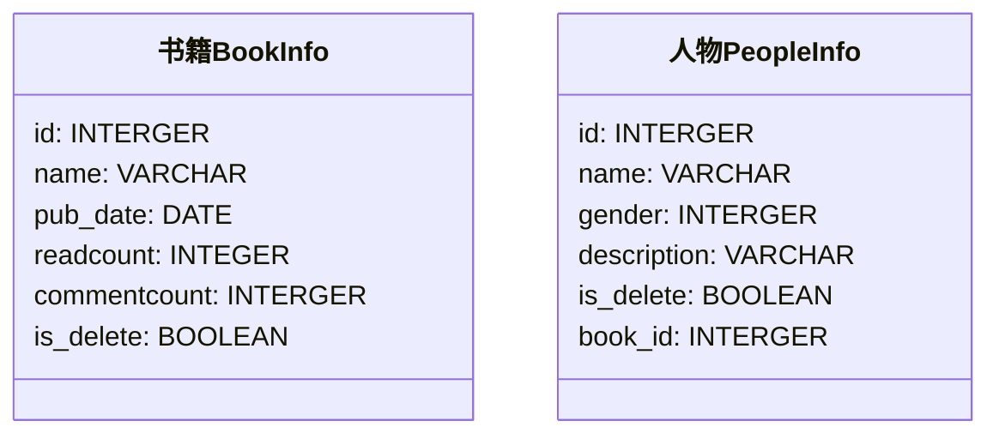

# 模型

## 一、定义模型类




### 1.1 定义书籍表

#### 1.1.1 编码


在 `/bookmanager/book/models.py` 定义模型：

```python
"""
1. 我们的模型类需要继承自 models.Model
2. 系统会自动添加一个主键 id
3. 字段定义
    3.1 属性
        字段名=models.类型(选项)
        字段名不要使用 python、mysql 等关键字
        字段名不要使用连续的下划线（__），因为后面的查询会用到 __
    3.2 类型   MySQL的类型
    3.3 选项  是否有默认值、是否唯一、是否为 null
             CharField 必须设置 max_length
             verbose_name 主要是 admin 站点使用
4. 改变表的名称
    默认表的名称是：子应用名_类名 都是小写
    修改表的名字 使用 class Meta: db_table = ''
"""
from django.db import models


class BookInfo(models.Model):
    name = models.CharField(max_length=10, unique=True, verbose_name='名称')
    pub_date = models.DateField(null=True, verbose_name='发布日期')
    readcount = models.IntegerField(default=0, verbose_name='阅读量')
    commentcount = models.IntegerField(default=0, verbose_name='评论量')
    is_delete = models.BooleanField(default=False, verbose_name='逻辑删除')

    class Meta:
        db_table = 'bookinfo'  # 指明数据库表名
        verbose_name = '书籍管理'  # 在 admin 站点中显示的名称

    def __str__(self):
        return self.name  # 定义每个数据对象的显示信息
```


#### 1.1.2 选项
| 选项        | 说明                                                         |
| ----------- | ------------------------------------------------------------ |
| null        | 如果为 True，表示允许为空，默认值是                          |
| blank       | 如果为 True，则该字段允许为空白，默认值是 False              |
| db_column   | 字段的名称，如果未指定，则使用属性的名称                     |
| db_index    | 如果为 True，则在表中会为此字段创建索引，默认是 False        |
| default     | 默认值                                                       |
| primary_key | 如果为 True，则该字段会成为模型的主键字段，默认值是 False，一般作为 `AutoField` 的选项使用 |
| unique      | 如果为 True，这个字段在表中必须有唯一值，默认值是 False      |

null 是数据库范畴的概念，blank 是表单验证范畴的


### 1.2 定义人物表

#### 1.2.1 编码

在 `/bookmanager/book/models.py` 定义 `PeopleInfo` 模型：

```python
class PeopleInfo(models.Model):
    name = models.CharField(max_length=10, unique=True, verbose_name='姓名')
    # 定义一个有序字典
    GENDER_CHOICE = (
        (1, 'male'),
        (2, 'female')
    )
    gender = models.SmallIntegerField(choices=GENDER_CHOICE, default=1, verbose_name='性别')
    description = models.CharField(verbose_name='描述', max_length=100, null=True)
    is_delete = models.BooleanField(default=False, verbose_name='是否删除')
    # 外键
    # 系统会自动为外键添加 _id

    # 外键的级联操作
    # 主表 和 从表
    #  1  对 多
    # 书籍 对 人物

    # 主表的一条数据 如果删除了
    # 从表有关联的数据，关联的数据怎么办呢？
    # SET_NULL 抛出异常，不让删除
    # CASCADE 级联删除
    book = models.ForeignKey(BookInfo, on_delete=models.CASCADE)

    class Meta:
        db_table = 'peopleinfo'
        verbose_name = '人物信息'

    def __str__(self):
        return self.name
```


#### 1.2.2 外键

在设置外键时，需要通过 `on_delete` 选项指明主表删除数据时，对于外键引用表数据如何处理，在 `django.db.modules` 中包含了可选常量：

* **`CASCADE`** 级联，删除主表数据时连同一起删除外键表中数据
* **`PROTECT`** 保护，通过抛出 **`ProtectedError`** 异常，来阻止删除主表中被外键应用的数据
* **`SET_NULL`** 设置为 `NULL` ，仅在该字段为 `null=True` 允许为 null 时可用
* **`SET_DEFAULT`** 设置为默认值，仅在该字段设置了默认值时可用
* **`SET()`** 设置为特定值或者调用特定方法
* **`DO_NOTHING`** 不做任何操作，如果数据库前置指明级联性，此选项会抛出 **`IntegrityError`** 异常


### 1.3 进行模型迁移

在 `/bookmanager/book/admin.py` 进行模型类的注册后，进行模型迁移：

1. 生成迁移文件

   `python manage.py makemigrations`

2. 执行迁移文件

   `python manage.py migrate`

此时在站点管理中就可以看到创建的表了。


## 二、添加测试数据

先插入主表数据：

```mysql
insert into bookinfo(name, pub_date, readcount, commentcount, is_delete) values 
('射雕英雄传', '1980-5-1', 12, 34, 0),
('天龙八部', '1986-7-24', 36, 40, 0),
('笑傲江湖', '1995-12-24', 20, 80, 0),
('雪山狐狸', '1987-11-11', 58, 24, 0);
```

再插入从表数据：

```mysql
insert into peopleinfo(name, gender, book_id, description, is_delete) values 
('郭靖', 1, 1, '降龙十八掌', 0),
('黄蓉', 0, 1, '打狗棍法', 0),
('黄药师', 1, 1, '弹指神通', 0),
('欧阳锋', 1, 1, '蛤蟆功', 0),
('梅超风', 0, 1, '九阴白骨爪', 0),
('乔峰', 1, 2, '降龙十八掌', 0),
('段誉', 1, 2, '六脉神剑', 0),
('虚竹', 1, 2, '天山六阳掌', 0),
('王语嫣', 0, 2, '神仙姐姐', 0),
('令狐冲', 1, 3, '独孤九剑', 0),
('任盈盈', 0, 3, '弹琴', 0),
('岳不群', 1, 3, '华山剑法', 0),
('东方不败', 0, 3, '葵花宝典', 0),
('胡斐', 1, 4, '胡家刀法', 0),
('苗若兰', 0, 4, '黄衣', 0),
('程灵素', 0, 4, '医术', 0),
('袁紫衣', 0, 4, '六和拳', 0);
```

## 三、shell 工具

`Django` 的 `manage` 工具提供了 `shell` 命令，帮助我们配置好当前工程的运行环境（如连接好数据库等），以便可以直接在终端中执行测试 python 语句。

首先 **进入虚拟环境，在虚拟环境中 **进入 `/bookmanager` 目录，通过如下命令进入 `shell`：

```shell
python manage.py shell
```

导入两个模型类，以便后续使用：

```python
from book.models import BookInfo, PeopleInfo
```

eg：


