# Pycharm 连接远程服务器开发
## 1.Pycharm 破解
远程开发需要使用专业版本 [Pycharm 专业版破解](https://blog.junxu666.top/p/7624.html)

## 2.连接远程服务器

1. Tools -> Deployment -> Configuration

   点击 `+`号，选择 `SFTP` 连接，随意取个名字，点击OK

2. 设置 `SSH` 参数

   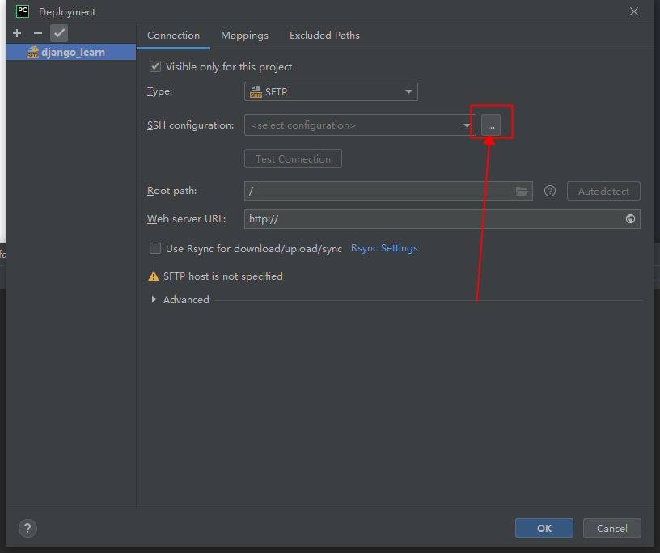

3. 测试能否连接服务器成功

   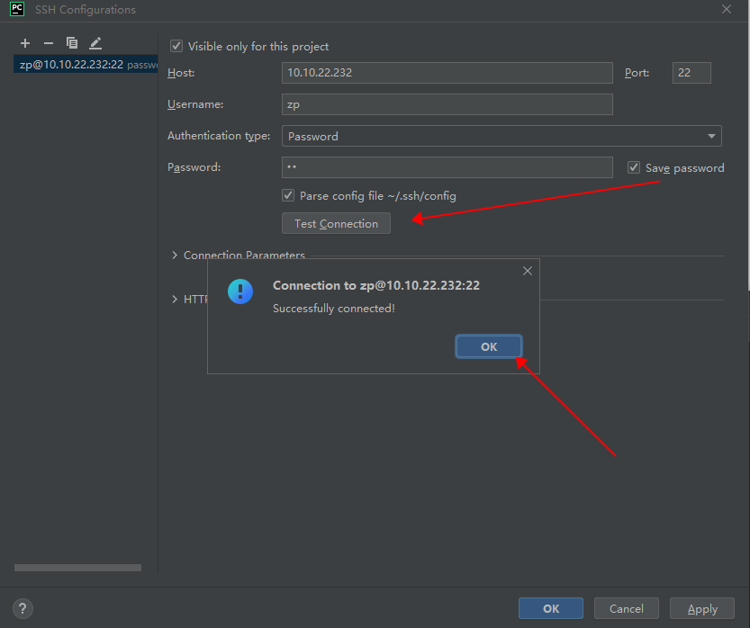

   点击 `Apply` 点击 `Ok`

4. 设置映射地址

   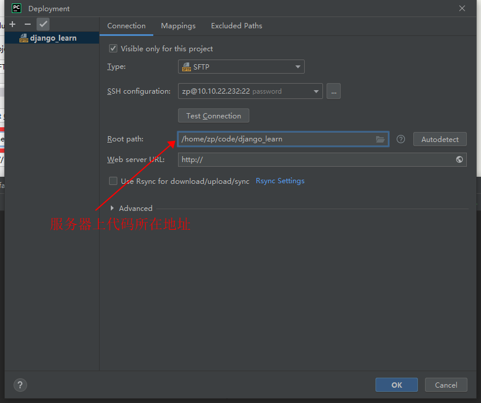

   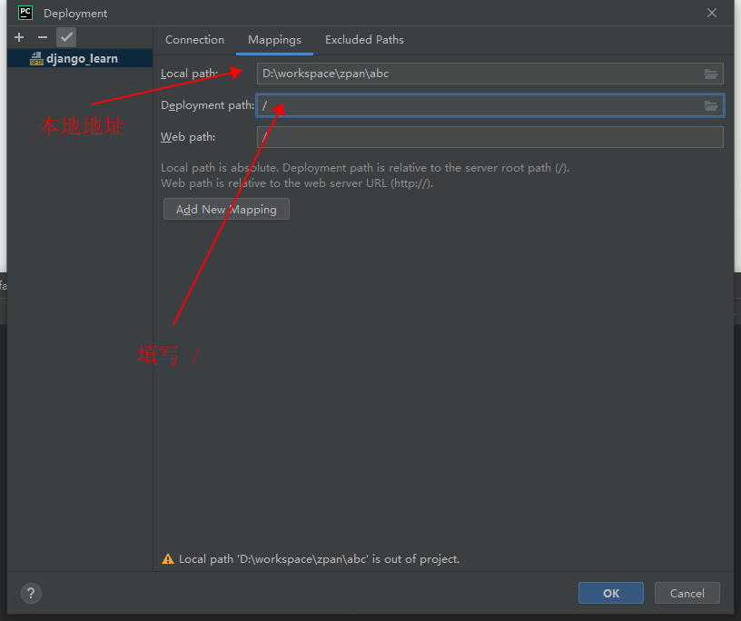

   点击`OK`

   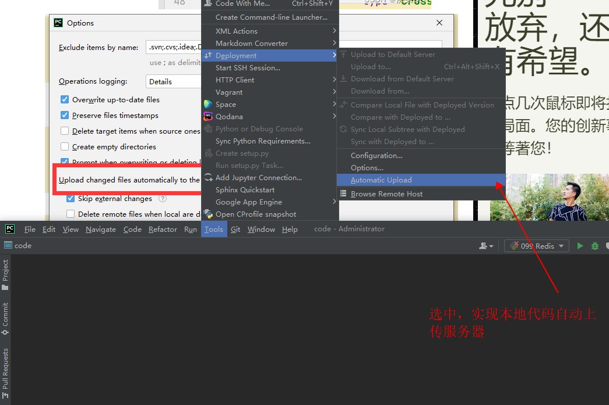

   打开 `Tools` -> `Deployment` -> `Options` 对话框：

   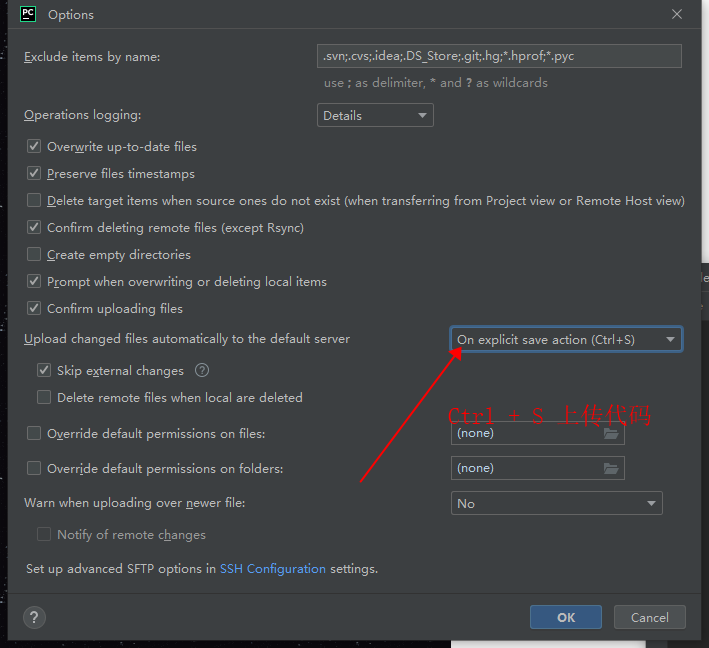

5. Pycharm 中设置解释器

   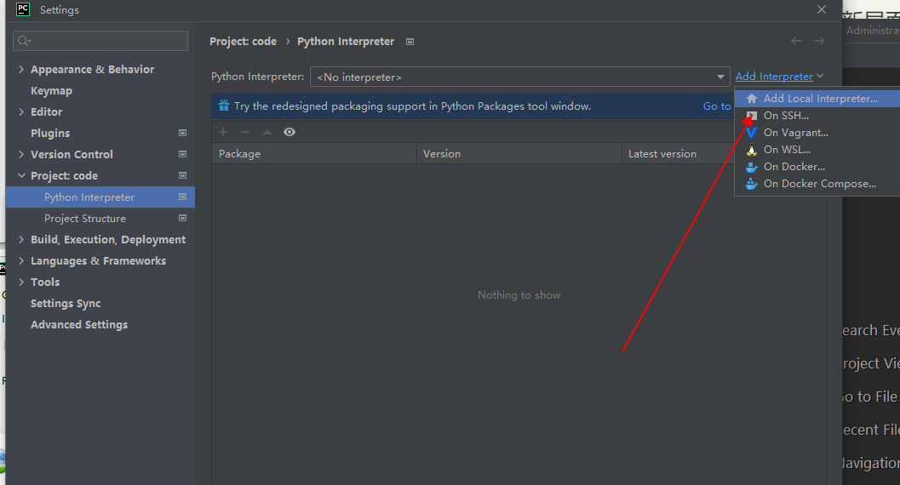

   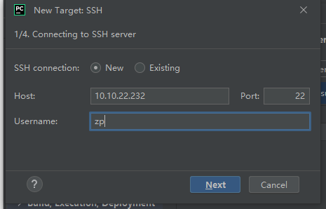

   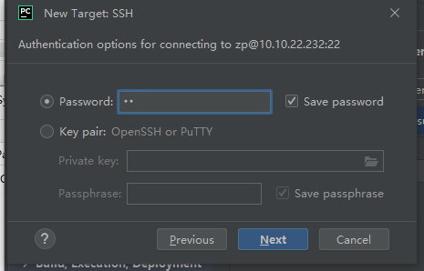

   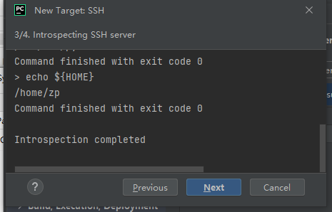

6. 设置终端运行的python版本：File -> Settings -> Tools -> SSH Terminal

   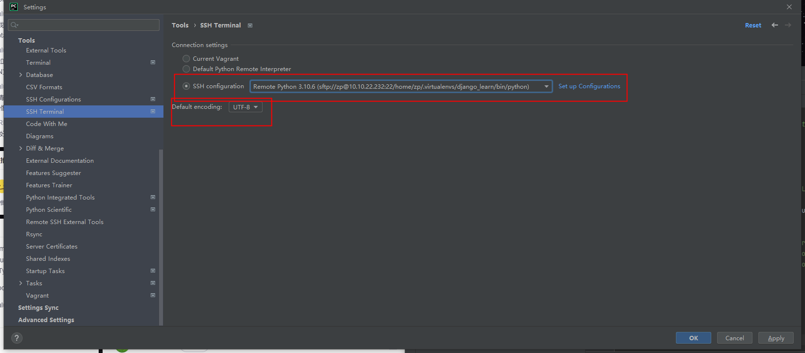

   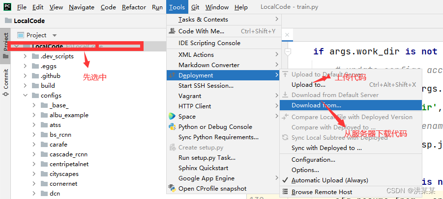