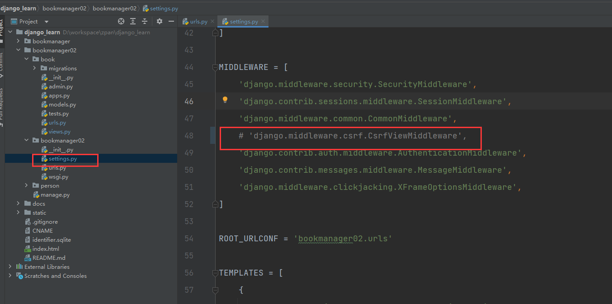

# 视图

## 一、项目准备工作

创建一个新的子项目(bookmanager02)，并进行数据迁移、生成等一系列基本配置，使其可以正常运行。

创建 `bookmanager02/book/urls.py` 文件：

```python
from django.urls import path
from book.views import create_book


urlpatterns = [
    path('create/', create_book)
]

```

修改 `bookmanager02/bookmanager02/urls.py`如下：

```python
from django.contrib import admin
from django.urls import path, include

urlpatterns = [
    path('admin/', admin.site.urls),
    path('', include('book.urls'))
]
```

重新运行项目，在浏览器中访问 `/create` 路径，页面显示 create 表示视图渲染成功。


## 二、使用 PostMan 对请求进行测试

## 三、HttpRequest 对象

利用 HTTP 协议向服务器传参有四种途径

### 3.1 URL路径传参

> 提取URL的特定部分，如 `/weather/beijing/2023`，可以在服务器端的路由中用正则表达式截取

`bookmanager02/book/views.py` 添加 `shop` 视图：

```python
def shop(request, city_id, shop_id):
    print(city_id, shop_id)
    return HttpResponse(city_id + shop_id)
```

`bookmanager02/book/urls.py` 添加 `shop` 路由:

```python
from django.urls import path
from book.views import create_book, shop


urlpatterns = [
    path('create/', create_book),
    path('<city_id>/<shop_id>', shop)
]

```

浏览器访问`/1101/1114`：


### 3.2 查询字符串传参

> 查询字符串（query string），形如 `key1=value1&key2=value2`

访问`/city/shop/?order=readcount` 使用 `request.GET` 获取查询字符串，值为`QueryDict`类型，即具有字典的特性，还具有一键多值的特性


**注意：**

默认以`request.GET.get('order')`获取到的是仅一个值的字符串，如果要获取`order`对应的列表，需要这样获取：

```python
request.GET.getlist('order')  # >>> ['readcount', 'commentcount']
request.GET.getlist('page')  # >>> ['1']
request.GET.get('page')  # >>> 1
request.GET.get('order')  # >>> commentcount
```


### 3.3 请求体（body）中发送数据

!!! get 也是可以有请求体的

> 请求体（body）中发送的数据，比如表单数据` json、xml`

#### 3.3.1 传递form表单数据

a. 注册路由和视图


b. `django` 默认是会对post请求进行验证的，我们需要把这个验证给他注释掉



c. 从`request.POST`里接收数据


#### 3.3.2 传递`json`数据


### 3.4 在 `http` 报文的请求头（header）中

> 在`http`报文的头（header）中

## 四、`HttpResponse` 对象

## 五、状态保持

## 六、类视图与中间件