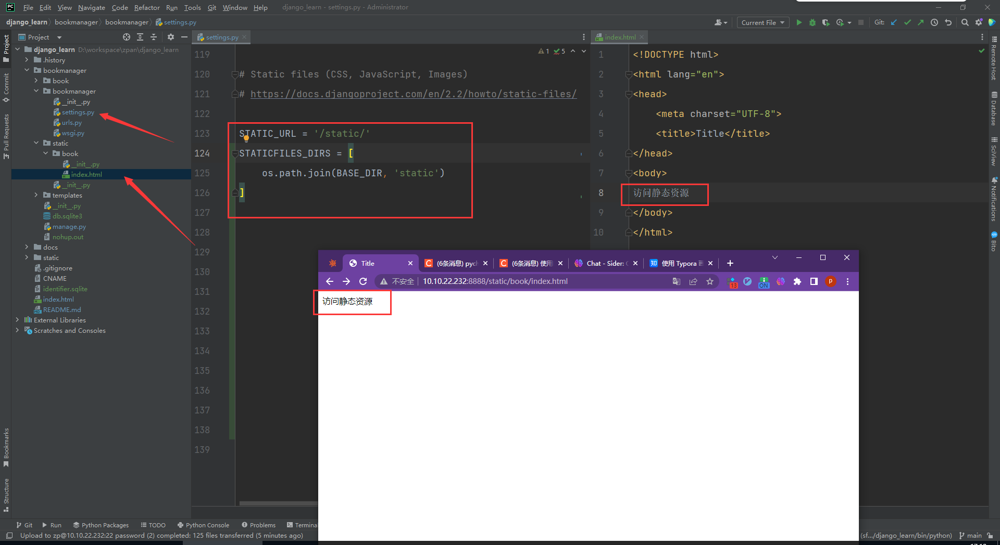
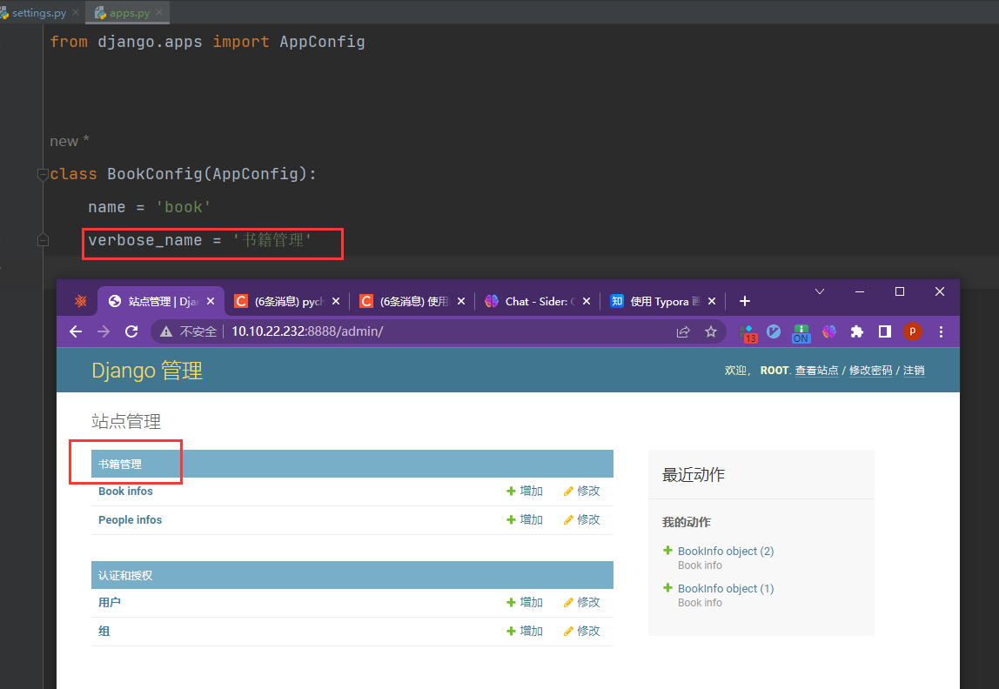

# `Django` 模型配置

## 一、`settings` 配置文件

### 1.1  `BASE_DIR`

```python
# __file__  =>  /home/zp/code/django_learn/bookmanager/bookmanager/settings.py
# 获取文件的绝对路径
# os.path.abspath(__file__)  =>  /home/zp/code/django_learn/bookmanager/bookmanager/settings.py
# os.path.dirname() 用来获取文件的目录
# os.path.dirname(os.path.abspath(__file__))  =>  home/zp/code/django_learn/bookmanager/bookmanager
# BASE_DIR 得到了工程的根目录
# BASE_DIR = os.path.dirname(os.path.dirname(os.path.abspath(__file__)))
BASE_DIR = os.path.dirname(os.path.dirname(os.path.abspath(__file__)))
```

表示当前工程的根目录，`Django` 会依此来定位工程内的相关文件，我们也可以使用该参数来构造文件路径。

### 1.2  `DEBUG` 调试模式

```python
DEBUG = True
```

在我们开发时，需要看到更多信息，所以需要设置 `DEBUG = True`，上线后需要设置为 `False`。

### 1.3  `ALLOWED_HOSTS`

```python
ALLOWED_HOSTS = ['*']
```

 当设置 `DEBUG = False` 时，需要设置 `ALLOWED_HOSTS`，表示允许以什么样的形式来访问我们的项目，默认是 `[]`，只能用 `127.0.0.1` 来访问，设置为 `*` 表示任何方式都可以访问，也可以指定 `ip`。

## 二、静态文件

项目中的 `CSS`、`图片`、`js` 都是静态文件。一般会将静态文件放到一个单独的目录中，以方便管理。在 `html` 页面中调用时，也需要指定静态文件的路径，`Django` 中提供了一种解析的方式配置静态文件路径。静态文件可以放在项目根目录下，也可以放在应用的目录下，由于有些静态文件在项目中是通用的，所以推荐放在项目的根目录下，方便管理。

为了提供静态文件，需要配置两个参数：

* `STATICFILES_DIRS` 存放查找静态文件的目录
* `STATIC_URL` 访问静态文件的 `URL` 前缀

### 2.1 在项目根目录下创建 `static` 目录来保存静态文件

### 2.2 在 `/bookmanager/bookmanager/settings.py` 中修改静态文件的两个参数为：

```python
STATIC_URL = '/static/'
STATICFILES_DIRS = [
    os.path.join(BASE_DIR, 'static')
]
```

### 3.3 此时在 `static` 中添加的任何静态文件都可以使用 `http://10.10.22.232:8888/static/文件` 来访问了。

> 如果是远程开发，需要确认创建的静态文件是否已经同步到服务器了。



## 三、`App` 应用配置

`/bookmanager/book/apps.py`  表示子应用配置相关信息。

```python
from django.apps import AppConfig
class BookConfig(AppConfig):
    name = 'book'
```

添加如下代码：`verbose_name = '书籍管理'`

```python
from django.apps import AppConfig
class BookConfig(AppConfig):
    name = 'book'
    verbose_name = '书籍管理'
```

效果如下：


